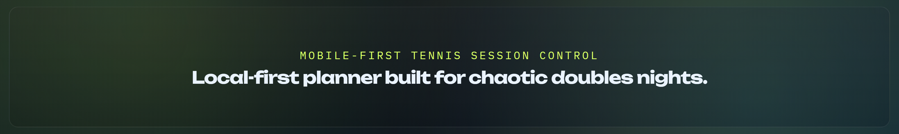
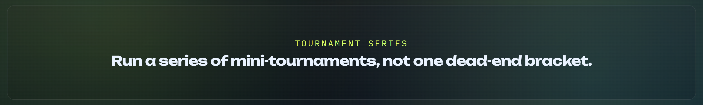
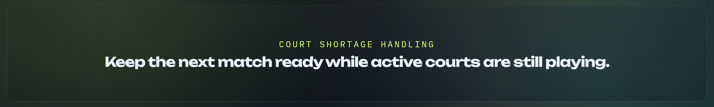
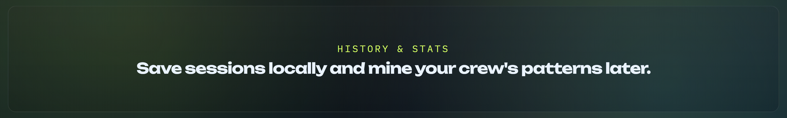

<p align="center">
  
</p>

<h1 align="center">Court Shuffle</h1>

<p align="center">
  <strong>Run doubles nights like a broadcast desk, not a clipboard.</strong><br />
  Local-first tennis session planning with balanced shuffles, tournament series, score tracking, and history.
</p>

<p align="center">
  <a href="https://d-gaspa.github.io/court-shuffle/">Live project: d-gaspa.github.io/court-shuffle</a>
</p>

<p align="center">
  
  
  
  
</p>

<p align="center">
  
</p>

Build balanced matchups, run tournament series, capture scores, and review the night later from local history.

## Why It Feels Different

Court Shuffle is built for real-world group sessions where the night is messy: changing player counts, limited courts, mixed singles/doubles formats, and people who still want decent match variety.

What makes it memorable:

- Tournament sessions are a **series of mini-tournaments**, not a single dead-end bracket
- You can **queue matches when courts are limited** and progress rounds as scores come in
- The app is **local-first** and stores roster, active state, and history in the browser
- It supports both **quick free shuffles** and **structured tournament play** in one workflow

## Core Capabilities

<p align="center">
  
</p>

- Manage a reusable player roster
- Start a session from any selected subset of players
- Run free-form shuffled rounds or tournament sessions
- Enter set scores per match
- Navigate rounds and mini-tournaments during a session
- Save finished sessions to local history for later review
- Explore stats/analytics views from saved sessions

## Session Modes

<p align="center">
  
</p>

### Free

Flexible team shuffling across rounds. Use this when you want balanced rotation and fast match generation.

### Tournament

Creates a tournament session made of one or more mini-tournaments in a series.

Tournament configuration includes:

- Format: `Consolation`, `Elimination`, or `Round Robin`
- Match type: `Singles (1v1)` or `Doubles (2v2)`
- Court shortage handling: queued courts with `Next Up` matches
- Optional doubles flexibility: `Allow 2v1 matchups`

## Tournament Series Behavior

<p align="center">
  
</p>

Tournament sessions prebuild a series of mini-tournaments from the selected players.

<p align="center">
  
</p>

- Move between mini-tournaments with dedicated tournament navigation controls
- Skip a mini-tournament if you do not want to play that shuffle/seeding
- Round navigation stays separate from mini-tournament navigation
- Progress and scores are preserved while browsing between mini-tournaments

### Singles Series

- Avoids repeating opening-round matchups across the generated series when possible

### Doubles Series

- Teams stay fixed within a mini-tournament
- Partner pairings are not repeated across the same tournament session when possible
- Sit-outs rotate across the series for odd player counts (strict doubles mode)

## Court Shortage Handling (Tournament)

<p align="center">
  
</p>

When a round has more matches than available courts:

- Active matches are shown on court and remaining matches appear as `Next Up`
- As results are entered, queued matches move onto courts automatically

Tournament progression advances only after the round scores required by the selected format are entered.

## History & Stats

<p align="center">
  
</p>

History feeds stats views for wins, volume, partner synergy, and matchup trends so your next session can be both fun and informed.

### Dashboards

<p align="center">
  
</p>

### Player Detail

<p align="center">
  
</p>

### Matchup Matrices

<p align="center">
  
</p>

<p align="center">
  
</p>

## Data Storage

Court Shuffle stores roster data, active session state, and session history in local browser storage on your device.

## Development

This project is a static HTML/CSS/JavaScript app (no framework required).

### Run locally

Serve the folder with any static file server.

```bash
python3 -m http.server 4173
```

or

```bash
npx serve
```

### Format / lint

Biome is used for formatting and lint checks:

```bash
npx biome check --write .
```
